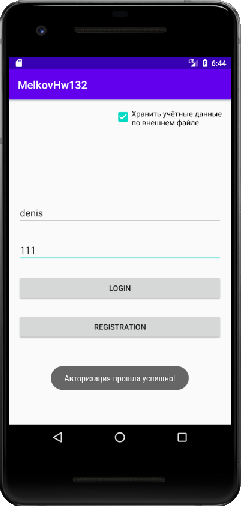

## Задача 2. Экспорт внутреннего файла во внешний и обратно.
### Описание
Часто файлами приложения приходится манипулировать и перекладывать их из внешнего хранилища во внутреннее и обратно.

### Задание
Возьмите домашнюю работу "Сохранение/восстановление текста во внутренний файл 5.2.1 и добавьте туда CheckBox "Хранить логин во внешнем хранилище". Если он выбран, работа с логином-паролем должна происходить через внешний файл, а если не выбран - через внутренний.

